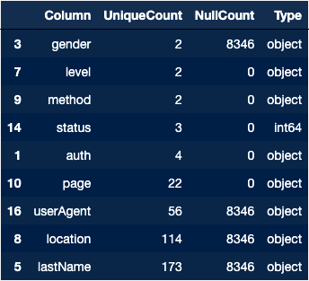
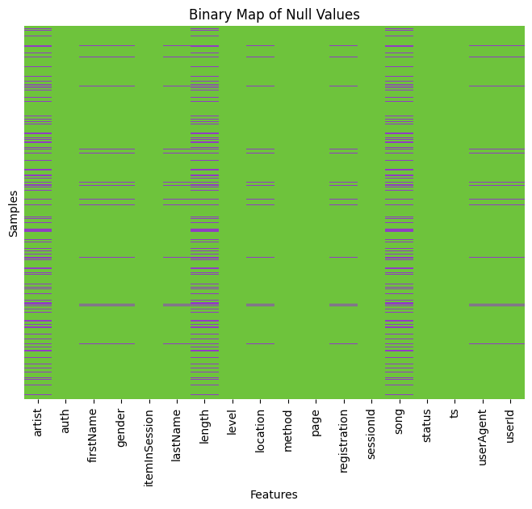

# Spark Churn Project
Churn Analysis Of Simulated User Data

## Introduction
We have been tasked with identifying users likely to cancel their usage of Sparkify. The data consists of simulated user data provided by Udacity, with each sample representing a record of API actions by the user. The ultimate goal is to train a model to identify user churn patterns, leveraging various big data architectures and tools, especially Apache Spark.

## Outline
The project is divided to various parts

- Exploratory Data Analysis
- Feature Engineering
- Model Development

## The Data
The dataset is divided into two subsets: a "mini" and a "large." The "mini" dataset enables quicker code development, providing a scalable foundation for working with our extensive "large" dataset.

## Exploratory Data Analysis
### Exploring Null Values

  
  

 
 

Looking over our summary counts of the data we can determine there are two groups distinct groups. One group’s features are related to uselogin information and the other to song-playing information.  We can dig deeper into this by building out a network map. The subsequent map illustrates the relationships between features (nodes) that exhibit null values simultaneously in the respective features.

 
 

  

 
Upon examining this network it appears that there is at least one instance where both the null groups were null in the same sample. To better visualize these null group patterns we can build a binary heatmap of the null values per sample.  In the image below, each purple mark signifies a null value in the respective sample (row).
 
 

  

 
 
The relationship observed in the Binary Null heatmap indicates that the null groups do have a partial relationship between them. When the group with features related to user information are null they are not listening to music, however, users may not be listening to music when they are logged in.

## Exploring Features
### Labeling Our Target
Since the objective is to predict which users will downgrade their service we need to have these users labeled as such. We are going to flag all users with  “Cancellation Confirmation”  in their history based on the  ‘page’ feature. We are using this instead of “Submit Downgrade” as many service providers will use various tactics to dissuade users from changing or leaving their current service plans. One tactic is to have users click through multiple pages, sometimes with imagery or text to convince the user to change their mind. At the time of this writing(December 2023), Spotify has users navigate through this screen before canceling their plan.

  

Clearly showing the benefits of using a paid level on Spotify versus the free level. The effectiveness of these types of techniques can be inferred from the data itself by looking at the visitations of the web pages related to changes in service level.

  

Even though we have a 1:1 match in our data set of "Cancel Confirmation" and "Cancel" we are going to stick with using "Cancel Confirmation" as our label indicator. This allows us to account for the potentiality of users that may change their minds.

Now that we have determined what feature our churn label is based on we can go ahead and use pyspark’s User Defined Function to flag users that are downgraded at some point. We use a list-match

  

## Model Development